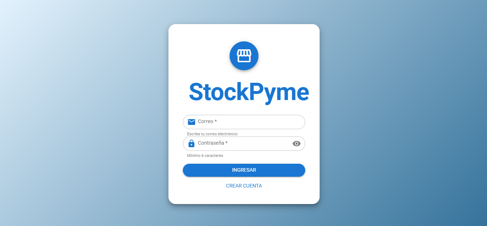

# 🖥️ MINI INVENTARIO – Frontend con Vue 3 + Quasar

Interfaz de usuario moderna desarrollada con **Vue 3** y **Quasar Framework**, que consume la API del backend **Mini Inventario** para gestionar productos, clientes y ventas, con integración de **Inteligencia Artificial** para generación de descripciones y recomendaciones inteligentes.


[alt text](./src/assets/cretecustomer.png)

 * Vestaña de Porductos
 [alt text](./src/assets/Products.png)

  * Vestaña de Clientes
 [alt text](./src/assets/Customer.png)
---

---

## 📋 Requisitos Previos

- **Node.js** v18 o superior
- **npm** v9 o superior
- Backend del proyecto ejecutándose (ver [repositorio del backend](https://github.com/JuanmaCode2025/Mini_Inventario_Backend.git))

---

## 🧠 Flujo de Trabajo del Frontend

1. **Inicio de sesión y autenticación**  
   Formulario con validaciones que consume JWT y almacena el token en `localStorage`.

2. **Dashboard principal**  
   Vista con métricas clave, gráficos y acceso rápido a todas las secciones.

3. **Gestión de productos**  
   CRUD completo con tablas, modales, validaciones y generación IA de descripciones.

4. **Gestión de clientes**  
   Listado, búsqueda, creación y edición de clientes.

5. **Registro de ventas**  
   Sistema de ventas con selección de productos y clientes, cálculo automático de totales.

---

## 🚀 Características Principales

- ⚡ **Vue 3 Composition API** – Código moderno y reactivo
- 🎨 **Quasar Framework** – Componentes UI ricos y responsivos
- 🔐 **Autenticación JWT** – Protección de rutas y manejo de sesión
- 📦 **Gestión completa** – Productos, clientes y ventas
- 🤖 **Inteligencia Artificial** – Generación de descripciones y recomendaciones
- 📱 **Diseño responsive** – Funciona en móvil, tablet y desktop
- 🧩 **Pinia** – Manejo de estado global
- 🛣️ **Vue Router** – Navegación entre páginas
- 🌐 **Axios** – Comunicación HTTP con el backend

---

## 🛠️ Tecnologías Utilizadas

| Tecnología         | Propiedad                                    |
|--------------------|----------------------------------------------|
| **Vue 3**          | Framework progresivo para UI                |
| **Quasar v2**      | Componentes UI y estilos Material Design    |
| **Pinia**          | Manejo de estado global                     |
| **Vue Router**     | Enrutamiento de la aplicación               |
| **Axios**          | Cliente HTTP para consumir API              |
| **Composition API**| Reactividad y lógica reutilizable           |
| **JWT**            | Autenticación y autorización                |
| **Vite**           | Build tool y servidor de desarrollo         |

---

## 📁 Estructura del Proyecto
* 📦 Frontend-mini-inventario


```
├── 📁 public
│   └── 🖼️ vite.svg
├── 📁 src
│   ├── 📁 assets
│   ├── 📁 components
│   │   ├── 📁 Dialog
│   │   │   └── 📄 SaleDetailDialog.vue
│   │   ├── 📁 Form
│   │   │   ├── 📄 FormCustomer.vue
│   │   │   ├── 📄 FormProducts.vue
│   │   │   └── 📄 FormSale.vue
│   │   ├── 📄 BaseTable.vue
│   │   └── 📄 CellDesign.vue
│   ├── 📁 composables
│   │   ├── 📄 Avatar.js
│   │   ├── 📄 Dates.js
│   │   ├── 📄 Mini-composables.js
│   │   └── 📄 Notifications.js
│   ├── 📁 layout
│   │   └── 📄 LayoutDashboard.vue
│   ├── 📁 plugins
│   │   └── 📄 pluginAxios.js
│   ├── 📁 routes
│   │   └── 📄 routes.js
│   ├── 📁 services
│   │   └── 📄 api_Clients.js
│   ├── 📁 store
│   │   └── 📄 StoreToken.js
│   ├── 📁 styles
│   │   └── 🎨 quasar-variables.sass
│   ├── 📁 views
│   │   ├── 📄 Create_Account.vue
│   │   ├── 📄 Customers.vue
│   │   ├── 📄 Dashboard.vue
│   │   ├── 📄 Login.vue
│   │   ├── 📄 Products.vue
│   │   ├── 📄 Sales.vue
│   │   └── 📄 text.txt
│   ├── 📄 App.vue
│   └── 📄 main.js
├── ⚙️ .gitignore
├── 📝 README.md
├── 🌐 index.html
├── ⚙️ package-lock.json
├── ⚙️ package.json
└── 📄 vite.config.js
```

---

## 🔗 Repositoria del Backend del Mini Inventario

Puedes probar y ver todos el bakned del mini intertario aquio el link del resporitorio

👉 **link del repositorio**  
https://github.com/JuanmaCode2025/Mini_Inventario_Backend.git

---

## ⚙️ Configuración del Entorno  e Instalación

Pasos de instalación
bash
# 1. Clonar el repositorio
 * Clonar frontend
git clone https://github.com/JuanmaCode2025/Frontend-mini-inventario.git

 *  Clonar backend
git clone https://github.com/JuanmaCode2025/Mini_Inventario_Backend.git

# 2. Entrar al directorio
cd frontend-mini-inventario

# 3. Instalar dependencias
npm install

# 4. Ejecutar en modo desarrollo
npm run dev


## Comandos Disponibles  
 * npm run dev : Seviror de desarrollo con hot-reload


👨‍💻 Autor
Juan Manuel Mejía Duarte
@JuanmaCode2025
📅 30 de Mayo de 2025

